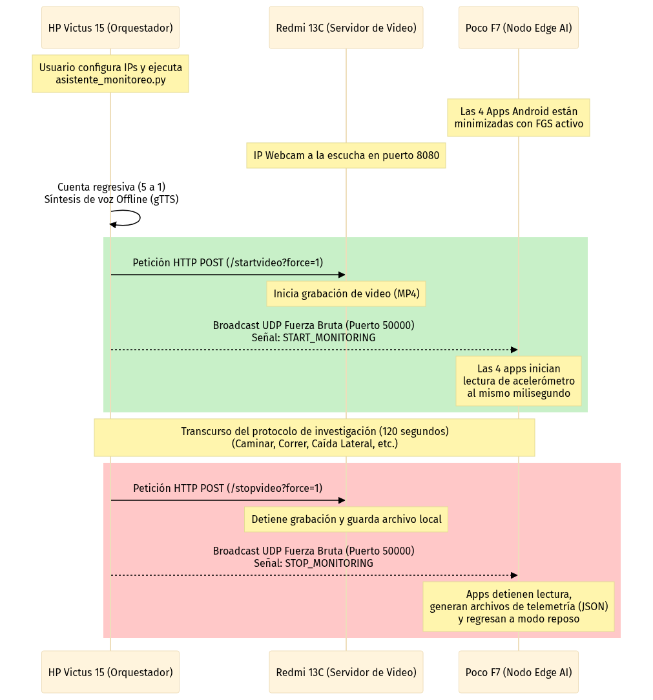

# 🔬 Sistema Maestro de Orquestación y Sincronización para Monitoreo de Caídas Multimodelo

Este proyecto contiene el orquestador central (`asistente_monitoreo.py`) desarrollado para coordinar y ejecutar pruebas científicas de "Fall Detection" (Detección de Caídas). Su objetivo principal es resolver el problema de la sincronización temporal entre múltiples modelos de Inteligencia Artificial que se ejecutan simultáneamente en el borde (Edge AI) y una fuente externa de validación en video. 

El sistema sincroniza la captura de datos inerciales (acelerómetro) de 4 aplicaciones diferentes en un solo teléfono, coordinándolas milimétricamente con la grabación de video de una cámara IP externa y guiando al usuario con instrucciones de voz automatizadas.

---

## ⚙️ Arquitectura de Hardware y Nodos del Sistema

El ecosistema está compuesto por tres nodos físicos principales que se comunican a través de una red de área local (LAN Wi-Fi). A continuación, se detalla el hardware y la responsabilidad técnica de cada uno:

### 1. Nodo Orquestador (Computadora Central)
* **Dispositivo:** Laptop HP Victus 15.
* **Hardware:** Procesador AMD Ryzen 5 (Serie 7000), Tarjeta Gráfica AMD Radeon RX 6550M dedicada.
* **Rol Técnico:** Actúa como el "cerebro" de la red. Ejecuta el script maestro en Python. Sus funciones son: 
  1. Renderizar la Interfaz Gráfica (GUI) para el investigador.
  2. Emitir "Subnet Directed Broadcasts" vía UDP para iniciar/detener los sensores en los dispositivos móviles de forma paralela.
  3. Realizar peticiones HTTP REST para controlar la grabación de video.
  4. Sintetizar la cuenta regresiva y las etapas del protocolo usando el motor de voz offline de Google (`gTTS`).

### 2. Nodo Servidor de Video (Cámara IP)
* **Dispositivo:** Xiaomi Redmi 13C.
* **Hardware:** Procesador MediaTek Helio G85, 4 GB de RAM, 128 GB de Almacenamiento interno.
* **Rol Técnico:** Actúa como un servidor de adquisición de imágenes (IP Webcam). Se mantiene a la escucha de peticiones HTTP `POST` en los endpoints `/startvideo` y `/stopvideo`. Su propósito es generar la evidencia visual que permitirá contrastar las inferencias de las inteligencias artificiales con el movimiento real del sujeto.

### 3. Nodo de Inferencia Edge AI (Sensores IA)
* **Dispositivo:** Poco F7.
* **Hardware:** Procesador Snapdragon de Alta Gama, 12 GB de RAM, 512 GB de Almacenamiento interno.
* **Rol Técnico:** Es el dispositivo que lleva el sujeto de prueba. Ejecuta 4 aplicaciones de Android de forma concurrente en la memoria RAM. Su trabajo es escuchar el puerto UDP `50000` en todo momento y, al recibir la señal, comenzar a leer el hardware del acelerómetro a 100Hz (`Sensor_Delay_Game`) para que los 4 modelos de Machine Learning evalúen la misma caída exacta.

---

## 🚀 Diagrama de Flujo y Sincronización

``

`mermaid
sequenceDiagram
    participant PC as HP Victus 15 (Orquestador)
    participant R13C as Redmi 13C (Servidor de Video)
    participant PF7 as Poco F7 (Nodo Edge AI)

    Note over PC: Usuario configura IPs y ejecuta<br/>asistente_monitoreo.py
    Note over PF7: Las 4 Apps Android están<br/>minimizadas con FGS activo
    Note over R13C: IP Webcam a la escucha en puerto 8080
    
    PC->>PC: Cuenta regresiva (5 a 1)<br/>Síntesis de voz Offline (gTTS)
    
    rect rgb(200, 240, 200)
    PC->>R13C: Petición HTTP POST (/startvideo?force=1)
    Note over R13C: Inicia grabación de video (MP4)
    
    PC-->>PF7: Broadcast UDP Fuerza Bruta (Puerto 50000)<br/>Señal: START_MONITORING
    Note over PF7: Las 4 apps inician<br/>lectura de acelerómetro<br/>al mismo milisegundo
    end
    
    Note over PC,PF7: Transcurso del protocolo de investigación (120 segundos)<br/>(Caminar, Correr, Caída Lateral, etc.)
    
    rect rgb(255, 200, 200)
    PC->>R13C: Petición HTTP POST (/stopvideo?force=1)
    Note over R13C: Detiene grabación y guarda archivo local
    
    PC-->>PF7: Broadcast UDP Fuerza Bruta (Puerto 50000)<br/>Señal: STOP_MONITORING
    Note over PF7: Apps detienen lectura,<br/>generan archivos de telemetría (JSON)<br/>y regresan a modo reposo
    end
```

---

## 🛡️ Soluciones de Ingeniería y Modificaciones a las Apps

Desde Android 9, el sistema operativo corta el acceso al hardware (acelerómetro, giroscopio) a cualquier aplicación que esté en segundo plano (minimizada). Para poder evaluar **4 modelos distintos simultáneamente en el Poco F7**, se inyectó una arquitectura de **Foreground Service (FGS)** que engaña al sistema de administración de batería de Android. 

A continuación, se detallan los 4 proyectos y las modificaciones idénticas que se aplicaron a cada uno para lograr la concurrencia:

### 1. `AplicacionEdgeImpulseDeteccionCaidas9clases`
* **Modificación en Código:** Se creó el archivo `DummyForegroundService.kt` el cual genera un canal de notificaciones con prioridad alta (`IMPORTANCE_HIGH`). 
* **Modificación en Manifest:** Se inyectaron los permisos obligatorios para Android 14: `FOREGROUND_SERVICE`, `FOREGROUND_SERVICE_DATA_SYNC` y `POST_NOTIFICATIONS`.
* **Ciclo de Vida:** Se modificó la clase `MainActivity.kt` inyectando el método `onResume()` para que, cada vez que la app pase por pantalla, ejecute un bloque `try/catch` obligando al servicio `dataSync` a encenderse y quedarse anclado en la memoria.

### 2. `AplicacionTensorFlowAndKeras17` (17 clases TF)
* **Modificación en Código:** Se integró el `DummyForegroundService.kt` independiente de sus servicios anteriores, asegurando el canal `monitoreo_channel_high` para forzar la notificación flotante.
* **Modificación en Manifest:** Aunque el proyecto ya tenía permisos de salud (`health`), se inyectó la rama `DATA_SYNC` y se vinculó en la declaración del servicio dentro del `<application>`.
* **Ciclo de Vida:** El `MainActivity.kt` fue parcheado para arrancar este proceso de inmunidad en segundo plano tan pronto como el usuario carga la vista principal.

### 3. `AplicacionEdgeImpulse17` (17 clases EI)
* **Modificación en Código:** Implementación total de `DummyForegroundService.kt` con llamadas compatibles para `Build.VERSION_CODES.Q` en adelante.
* **Modificación en Manifest:** Declaración explícita de `android:foregroundServiceType="dataSync"` para cumplir con las rigurosas políticas de Android 14 en el Poco F7.
* **Ciclo de Vida:** Inyección en `onResume()` para garantizar que la recolección UDP siga viva incluso al presionar el botón *Home*.

### 4. `tflite-keras-9class-app` (TensorFlow Lite 9 clases)
* **Modificación en Código:** Restauración e inyección del archivo `DummyForegroundService.kt` con icono de sistema, texto persistente ("Monitoreo en curso") y bandera `START_STICKY` para reinicio automático.
* **Modificación en Manifest:** Inyección de la dependencia de notificaciones de Android 13+ (`POST_NOTIFICATIONS`) para evitar excepciones de seguridad en tiempo de ejecución.
* **Ciclo de Vida:** Se escaneó y reemplazó la estructura del `MainActivity.kt` para insertar el hook de `startForegroundService` garantizando el bypass del acelerómetro.

### Ajustes en el Script de Python y Cámara IP Webcam
Para la aplicación "IP Webcam", se eliminó el requerimiento de iniciar el video tocando la pantalla. En el script `asistente_monitoreo.py`, se implementaron peticiones HTTP POST estructuradas (`urllib.request.urlopen`) que atacan la API web interna de la app (`/startvideo?force=1` y `/stopvideo?force=1`). 
Además, el script de Python fue dotado de un algoritmo **Brute-force Subnet Broadcast**, el cual escanea las interfaces de red de Windows (ignorando adaptadores virtuales como VirtualBox) y envía la señal UDP masivamente, garantizando que el Poco F7 la reciba al instante sin latencia de ruteo.

---

## 🔊 Sistema de Asistencia por Voz (Motor Offline)
Para guiar al sujeto de prueba a lo largo de los 120 segundos del protocolo sin necesidad de interacción manual, el orquestador (`asistente_monitoreo.py`) cuenta con un motor de síntesis de voz en español basado en la librería de Google Text-to-Speech (`gTTS`) y `pygame`.

Su funcionamiento destaca por las siguientes características de ingeniería:
* **Hilos Asíncronos (`threading` y `queue`)**: La síntesis y reproducción de audio corren en un hilo paralelo. Esto garantiza que la voz hable mientras el programa continúa su ejecución matemática, evitando que la reproducción de audio retrase los *Broadcasts UDP* o congele la interfaz gráfica de Tkinter.
* **Caché Inteligente Offline (`voz_cache/`)**: Dado que el protocolo puede ejecutarse en áreas sin acceso a internet (o utilizando un punto de acceso LAN aislado), el sistema procesa, descarga y guarda permanentemente los audios generados (`.mp3`). Una vez procesados la primera vez, el sistema funciona de forma 100% local y desconectada de la red.
* **Tolerancia a Fallos y Archivos Corruptos**: Si el sistema detecta una caída de internet durante la generación y se crea un archivo corrupto de 0 bytes (un problema recurrente en las librerías web), el algoritmo intercepta el error, evalúa el tamaño físico del archivo (`os.path.getsize`), desecha los archivos corruptos y previene que el programa principal falle estrepitosamente.

---

## 📖 Modo de Uso

1. **Preparar el Nodo Edge (Poco F7):** Abre las 4 aplicaciones modificadas. Minimízalas presionando "Home". Verás que las 4 notificaciones flotantes de alta prioridad permanecen en pantalla, confirmando el bypass del sensor.
2. **Preparar el Nodo de Video (Redmi 13C):** Abre *IP Webcam* y presiona "Start Server". Identifica la IP local (Ej. `192.168.100.111`).
3. **Ejecutar el Orquestador (Laptop HP):**
   ```powershell
   python asistente_monitoreo.py
   ```
4. En la interfaz gráfica, ingresa la IP del Redmi 13C. Deja la IP del Poco F7 en `255.255.255.255`.
5. Presiona **INICIAR PROTOCOLO**. El audio te indicará el conteo regresivo y el progreso. Al terminar, la cámara se cortará sola y tendrás 4 JSON generados con tu telemetría sincronizada en el Poco F7.
