# 🔬 Sistema de Orquestación y Monitoreo de Caídas Multimodelo

Este proyecto contiene el orquestador maestro (`asistente_monitoreo.py`) encargado de sincronizar pruebas científicas de caída (Fall Detection). Permite ejecutar y controlar simultáneamente 4 modelos de Inteligencia Artificial distintos en un solo teléfono, coordinando la captura de datos (acelerómetro) con la grabación de video desde un segundo teléfono, y guiando al sujeto de prueba mediante comandos de voz.

## ⚙️ Arquitectura de Hardware y Diagrama de Flujo

El ecosistema utiliza tres dispositivos principales que se comunican a través de una red Wi-Fi local (LAN):

1. **Computadora Orquestadora (HP Victus 15)**: Procesador AMD Ryzen 5 7000 Series, Gráficos AMD Radeon RX 6550M. Ejecuta el script maestro en Python.
2. **Cámara IP (Redmi 13C)**: Procesador MediaTek Helio G85, 4GB RAM, 128GB Almacenamiento. Actúa como servidor de video HTTP.
3. **Sensores IA (Poco F7)**: Procesador de alto rendimiento (Snapdragon), 12GB RAM, 512GB Almacenamiento. Ejecuta 4 aplicaciones de Android simultáneamente en segundo plano.

### Diagrama de Flujo y Sincronización

```mermaid
sequenceDiagram
    participant PC as HP Victus 15<br/>(Ryzen 5, RX 6550M)
    participant R13C as Redmi 13C<br/>(Helio G85, 4GB RAM)<br/>Cámara IP
    participant PF7 as Poco F7<br/>(12GB RAM, 512GB)<br/>4 Apps Android

    Note over PC: Usuario ejecuta<br/>asistente_monitoreo.py
    Note over PF7: Apps minimizadas con<br/>ForegroundService activo
    Note over R13C: IP Webcam a la espera
    
    PC->>PC: Cuenta regresiva (5 a 1)<br/>Síntesis de voz Offline (gTTS)
    
    rect rgb(43, 60, 43)
    PC->>R13C: Petición HTTP POST (/startvideo?force=1)
    Note over R13C: Inicia grabación de video
    
    PC-->>PF7: Broadcast UDP Fuerza Bruta (Puerto 50000)<br/>Señal: START_MONITORING
    Note over PF7: Las 4 apps inician<br/>lectura de acelerómetro<br/>simultáneamente
    end
    
    Note over PC,PF7: Transcurso del protocolo (120 segundos)<br/>(Caminar, Correr, Caída Lateral, etc.)
    
    rect rgb(60, 43, 43)
    PC->>R13C: Petición HTTP POST (/stopvideo?force=1)
    Note over R13C: Detiene grabación de video
    
    PC-->>PF7: Broadcast UDP Fuerza Bruta (Puerto 50000)<br/>Señal: STOP_MONITORING
    Note over PF7: Apps detienen lectura,<br/>generan archivos JSON<br/>en memoria interna
    end
```



## 🛠️ Tecnologías y Librerías Utilizadas

* **Python 3.11+**:
  * `tkinter`: Para la Interfaz Gráfica de Usuario (GUI) y cronómetro.
  * `gTTS` (Google Text-to-Speech) / `pygame`: Generación de comandos de voz en español y reproducción asíncrona con sistema de caché offline.
  * `socket`: Comunicación UDP mediante Subnet Directed Broadcast.
  * `urllib.request`: Comunicación HTTP REST para la cámara.
  * `threading` / `queue`: Gestión del motor de voz y temporizadores para no bloquear la UI.

* **Android / Kotlin (Aplicaciones Cliente)**:
  * `Foreground Service (dataSync)`: Mantiene viva la aplicación en segundo plano.
  * `DatagramSocket`: Escucha de paquetes UDP.
  * `SensorManager`: Lectura continua del acelerómetro a 100Hz (Sensor_Delay_Game).
  * Jetpack Compose & TensorFlow Lite / Edge Impulse (En los proyectos nativos).

## 🚀 Modificaciones Críticas del Proyecto (Hacks y Soluciones)

Para lograr que 4 aplicaciones de Android leyeran el hardware del acelerómetro *al mismo tiempo* (algo prohibido por defecto por el sistema operativo desde Android 9 para ahorrar batería), se inyectó la siguiente arquitectura en los 4 proyectos de Android Studio (9 clases, 17 clases TF, LiteRT, Edge Impulse):

1. **`DummyForegroundService.kt` (Servicio en Primer Plano)**:
   Se programó un servicio que engaña al sistema de administración de energía de Android. Al atar el servicio a una **Notificación Flotante de Prioridad Alta (`IMPORTANCE_HIGH`)** y declarar el tipo `dataSync` en Android 14, Android clasifica a las 4 aplicaciones como "En uso activo por el usuario" incluso cuando están minimizadas, permitiendo leer los sensores de forma indefinida y simultánea.
2. **Permisos en Manifest**: Se agregaron permisos críticos como `FOREGROUND_SERVICE_DATA_SYNC`, `POST_NOTIFICATIONS` y `WAKE_LOCK`.
3. **Inyección en `onResume`**: Se aseguró que el servicio se dispare automáticamente al abrir la app, evitando cierres si el sistema mata el proceso.

### Modificación para la Cámara (IP Webcam)
Se configuró el script de Python para enviar peticiones HTTP `POST` a los endpoints de la API web local de "IP Webcam" (`/startvideo?force=1` y `/stopvideo?force=1`). Esto elimina la necesidad de interactuar manualmente con la pantalla del celular de grabación.

## 📖 Modo de Uso

1. **Preparación Android (Poco F7)**: Abre las 4 aplicaciones, ingresa un número de teléfono en ellas y minimízalas. Verás 4 notificaciones de "Monitoreo en curso".
2. **Preparación Cámara (Redmi 13C)**: Abre IP Webcam, dale a "Start Server" y anota la IP.
3. **Lanzar Orquestador (PC)**:
   ```bash
   python asistente_monitoreo.py
   ```
4. Ingresa la IP de la cámara en la ventana de Python. Deja la IP del celular en `255.255.255.255`.
5. Pulsa **INICIAR PROTOCOLO** y colócate en posición. El asistente te guiará con la voz.

## ⚠️ Errores Comunes y Soluciones

* **Error: El asistente no habla / Se congela al inicio**
  * **Causa**: No hay internet y el caché de audio de `gTTS` está incompleto o corrupto.
  * **Solución**: Conecta el PC a internet 1 minuto para generar el caché, o asegúrate de que el script haya eliminado los `.mp3` de 0 bytes. Una vez generado, es 100% offline.
* **Error: `MissingForegroundServiceTypeException` o `SecurityException` en Android 14**
  * **Causa**: Android requiere permisos específicos como `dataSync` o `health`.
  * **Solución**: Ya está solucionado en el código fuente actual, pero si ocurre, asegúrate de haber recompilado la app (`Play` en Android Studio) con la última versión del Manifest.
* **Error: Las aplicaciones no reciben el inicio (La cámara sí)**
  * **Causa**: Windows envió el broadcast UDP por una red virtual (ej. VirtualBox) en lugar del Wi-Fi.
  * **Solución**: El script ya usa **"Brute-force Subnet Directed Broadcast"**, que calcula todas las subredes del PC (ej. 192.168.100.255) y dispara la señal por todas partes, garantizando la entrega.
