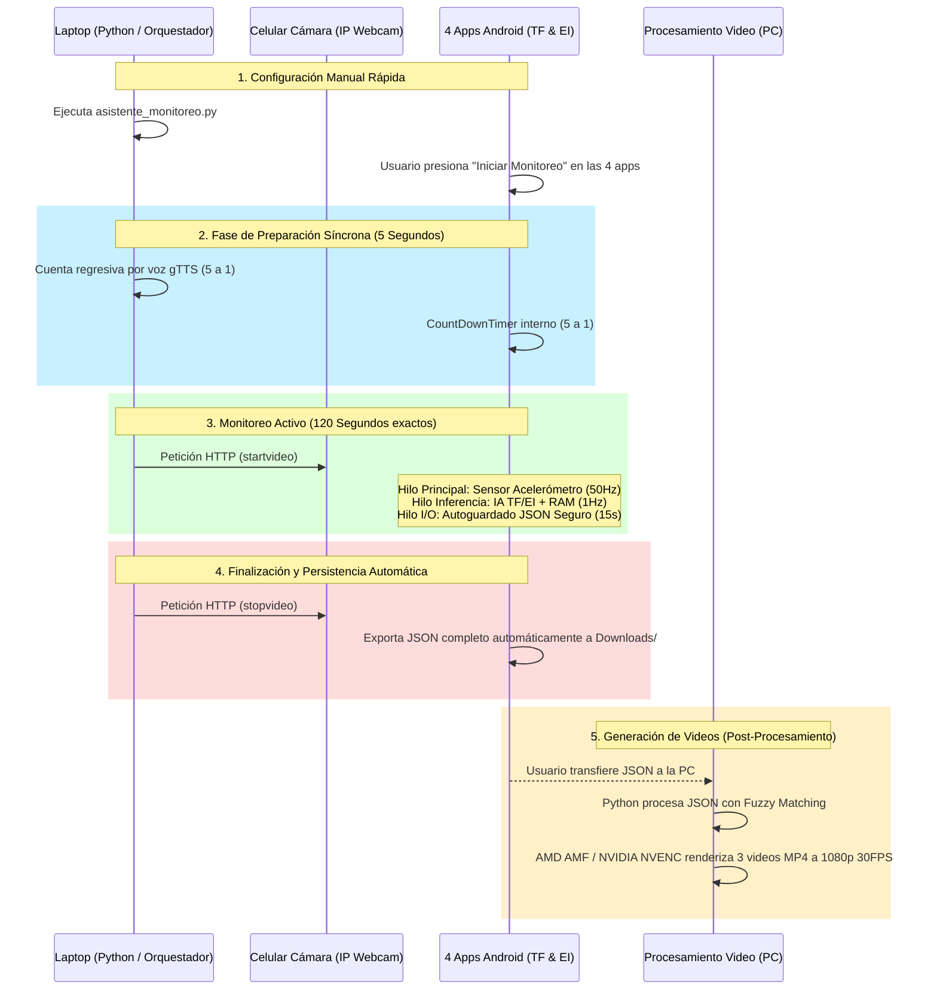
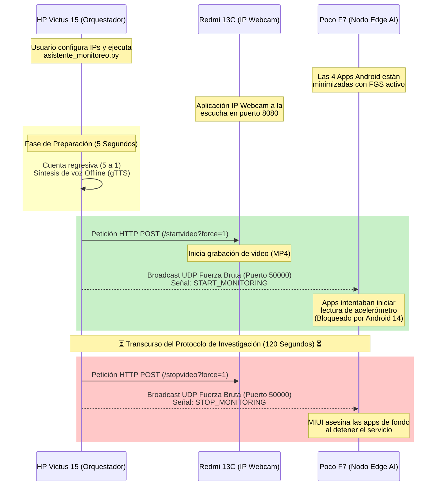

# 🔬 Sistema Maestro de Sincronización Diferida para Monitoreo de Caídas Multimodelo

Este proyecto contiene el orquestador central (`asistente_monitoreo.py`) desarrollado para coordinar y ejecutar pruebas científicas de "Fall Detection" (Detección de Caídas). Su objetivo principal es resolver el problema de la sincronización temporal entre múltiples modelos de Inteligencia Artificial que se ejecutan simultáneamente en el borde (Edge AI) y una fuente externa de validación en video.

Debido a estrictas políticas de seguridad implementadas en Android 14 respecto al control remoto de sensores en segundo plano, la sincronización se realiza mediante una **Fase de Preparación Diferida de 5 Segundos**. Esto permite a los 4 modelos aislarse de la red Wi-Fi y garantizar una captura de telemetría ininterrumpida y 100% íntegra durante exactamente 120 segundos.

---

## ⚙️ Arquitectura Actual (Sincronización Diferida y Exportación Automática)

Para lograr capturas de alta frecuencia (14,000+ puntos de acelerómetro por prueba) sin bloqueos del sistema operativo, el protocolo actual opera de la siguiente manera:

1. **Retardo Pre-Programado (5s):** Cada aplicación Android fue reprogramada (mediante `CountDownTimer` y Corrutinas) para iniciar una cuenta regresiva visual de 5 segundos al presionar el botón "Iniciar Monitoreo". 
2. **Sincronización Humana:** Este retardo de 5 segundos brinda el margen físico exacto para que el investigador inicie las 4 aplicaciones manualmente en el dispositivo Edge y posteriormente presione "Enter" en el script de Python.
3. **Escritura Asíncrona Concurrente:** Una vez pasados los 5 segundos, inicia el protocolo de 120s reales. Cada segundo, las aplicaciones escriben una copia de seguridad en memoria volátil de forma paralela (evitando colisiones en el Hilo Principal) y guardan exactamente 50 capturas inerciales por segundo.
4. **Exportación Automática en Cero:** En el milisegundo en que la prueba culmina (segundo 120), cada aplicación exporta de forma **síncrona y automática** el archivo JSON completo (aprox. 1.9 MB) al directorio `Downloads` del dispositivo, garantizando que el sistema operativo no asesine la memoria RAM de la aplicación antes de que los datos sean persistidos.

### Diagrama de la Arquitectura Funcional Definitiva (Aislada y Segura)



---

## ✨ Mejoras Técnicas Finales (Generación de Videos y Optimización de Telemetría)

Para asegurar un grado de investigación científica del más alto nivel, se implementaron múltiples correcciones al manejo de concurrencia y posprocesamiento visual de los datos:

1. **Paridad de Muestreo (50Hz en Edge Impulse):** Se ajustó el motor de `MonitoringLogManager` (`FULL_HISTORY_DECIMATION = 1`) para obligar a los proyectos de Edge Impulse a no desechar datos, logrando que graben **+5,580 puntos del acelerómetro** por sesión, igualando perfectamente la densidad de los modelos nativos de TensorFlow Lite.
2. **Blindaje contra ConcurrentModificationException:** Debido a la monstruosa velocidad del acelerómetro, se inyectaron bloques `synchronized(fullSensorHistory)` en Android para garantizar que los guardados periódicos automáticos del archivo JSON en segundo plano no crasheen la app al chocar con el Hilo Principal del sensor.
3. **Renderizado de Video Acelerado por Hardware:** Se desarrolló una suite en Python con `Matplotlib` y `FFmpeg` que lee los JSON y utiliza la tarjeta de video (NVENC o AMF) para renderizar a **1080p y 30 FPS**. Se implementó una "Ventana Deslizante" (Sliding Window) de 15 segundos para evitar superposiciones tipográficas en los gráficos, asegurando marcas precisas cada 1.0 segundos.
4. **Fuzzy Matching de Clases (Unicode):** Se inyectó un parche en los scripts de video en Python (`unicodedata`) para ignorar acentos, mayúsculas y sufijos, de forma que predicciones problemáticas como `"Caída hacia atrás"` enlacen matemáticamente a la perfección con el eje Y sin crear vacíos en la renderización final.

---

## 🏛️ Primer Intento de Prueba: Orquestación Total vía UDP (Deprecado)

En la fase inicial de desarrollo, se intentó implementar un sistema de orquestación 100% automatizado, donde el orquestador enviaba paquetes *UDP Subnet Directed Broadcasts* por el puerto `50000` para obligar a las 4 aplicaciones a despertar simultáneamente desde segundo plano.

### 🚫 Restricciones Técnicas de Google (Android 14+)
A pesar de modificar los *Manifests* y usar *WakeLocks* (`PowerManager.PARTIAL_WAKE_LOCK`), este enfoque automatizado falló debido a las siguientes restricciones de arquitectura del SO:
1. **ForegroundServiceStartNotAllowedException:** Android 14 implementó una política severa de *App Standby* y *Doze Mode* que prohíbe explícitamente a las aplicaciones minimizadas iniciar un `ForegroundService` (incluyendo tipos `health` o `dataSync`) en respuesta a un estímulo de red silencioso (como UDP) sin interacción directa del usuario.
2. **Asesinato Inmediato de RAM por HyperOS/MIUI:** Al terminar el tiempo establecido remotamente, el servicio mandaba detenerse (`stopSelf()`). En fracciones de segundo, el agresivo recolector de basura de Xiaomi (HyperOS) mataba el proceso contenedor de las aplicaciones de fondo. Esto provocaba que al momento de que el usuario abría la app para exportar manualmente, el puntero del Singleton (`_currentSession.value`) ya fuera nulo, obligando a la app a restaurar *backups* fantasmas cacheados de fechas antiguas (ej. datos de Mayo en lugar de los actuales).

### Diagrama de la Arquitectura UDP Original (Como Referencia Histórica)



### Modificaciones Previas de Ingeniería (Inyectadas pero Insuficientes)
*   Se crearon servicios como `DummyForegroundService.kt` con canales de notificación de alta prioridad.
*   Se inyectaron dependencias como `ACTIVITY_RECOGNITION` y `POST_NOTIFICATIONS` en los *Manifests*.
*   Se usaron Banderas como `START_STICKY` y llamadas a `startForegroundService` en el `onResume()`.

*A pesar de estos grandes esfuerzos de ingeniería, la asimetría en el tratamiento de procesos de fondo entre teléfonos modernos forzó la transición a la estrategia actual de retraso de 5 segundos.*

---

## 🔊 Sistema de Asistencia por Voz (Motor Offline)
Para guiar al sujeto de prueba a lo largo de los 120 segundos del protocolo sin necesidad de interacción manual, el orquestador (`asistente_monitoreo.py`) cuenta con un motor de síntesis de voz en español basado en la librería de Google Text-to-Speech (`gTTS`) y `pygame`.

Su funcionamiento destaca por las siguientes características de ingeniería:
* **Hilos Asíncronos (`threading` y `queue`)**: La síntesis y reproducción de audio corren en un hilo paralelo.
* **Caché Inteligente Offline (`voz_cache/`)**: El sistema procesa, descarga y guarda permanentemente los audios generados (`.mp3`). Una vez procesados, funciona de forma 100% local.
* **Tolerancia a Fallos**: Evita crasheos al evaluar el tamaño físico del archivo (`os.path.getsize`), desechando archivos corruptos de 0 bytes si cae el internet.

---

## 📖 Modo de Uso Actual

1. **Preparar el Nodo Edge (Poco F7):** Abre las 4 aplicaciones y colócalas listas en la pantalla de inicio o multitarea. 
2. **Preparar el Nodo de Video (Redmi 13C):** Abre *IP Webcam* y presiona "Start Server".
3. **Ejecutar el Orquestador (Laptop HP):**
   ```powershell
   python asistente_monitoreo.py
   ```
4. **Sincronización:** 
   * Toca velozmente el botón **"Iniciar Monitoreo"** en las 4 aplicaciones Android. Estas entrarán en una cuenta regresiva de 5 segundos.
   * Inmediatamente, presiona **"INICIAR PROTOCOLO"** en tu computadora.
5. **Prueba y Extracción:** Realiza tu protocolo físico de 120s. Al finalizar, la cámara se detendrá sola desde Python, y mágicamente encontrarás los **4 archivos JSON completos** en la carpeta `Downloads` de tu celular gracias a la exportación automática integrada en el milisegundo exacto de cierre.
